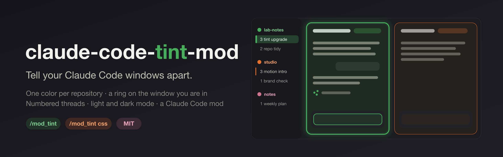

<p align="center">
  
</p>

[](CHANGELOG.md)
[](LICENSE)
[](https://code.claude.com/docs/en/plugins/mods/overview)

# claude-code-tint-mod

A Claude Code mod (CC mod: a plugin that changes how Claude Code looks and behaves) that helps you tell your windows apart. Every repository gets one identity (an emoji that says what the repository is, and a color taken from that emoji), and every window of a repository gets a number.

**Why:** with two or three Claude Code windows side by side, it is easy to type into the wrong one. This mod gives each repository its color, puts a ring around the window you are in, and keeps the sidebar calm except for what you are working on.

| Where | What you see |
|---|---|
| Window titles | `🧪1️⃣ <main topic>`, kept on the main topic by Claude (desktop) |
| Terminal | a patterned strip in the repo's color above the prompt |
| Your own messages | a border in the window's color, if you turn it on (`/mod_tint frame on`) |
| **The whole desktop app** | with `/mod_tint css`, see below |

## Install

In Claude Code, type:

```
/plugin marketplace add JimmySadek/claude-code-tint-mod
/plugin install tint@claude-code-tint-mod
/reload-plugins
```

Then type `/mod_tint` to check. You should see the help.

> If `/plugin` doesn't work where you are, run this in the Terminal instead, then start a new session:
> `claude plugin marketplace add JimmySadek/claude-code-tint-mod && claude plugin install tint@claude-code-tint-mod`

## Color the whole desktop app (optional)

A mod can draw inside the conversation, but not the app around it. For the full look (ring, tints, colored sidebar), you save a small script in the desktop app's DevTools once. After that it takes four keys each time you start the app.

> **Why not fully automatic?** The desktop app doesn't load outside scripts. It refuses to start with debugging switches and its code is sealed, which protects your signed-in account. A saved snippet is the safe way in.

**Once: turn on Developer Mode.** In the Claude desktop app's menu bar: **Help → Troubleshooting → Enable Developer Mode…**, then confirm. This unlocks the app's DevTools (the inspector panel).

**Once: save the script as a snippet.**

1. In Claude Code, type `/mod_tint css`. The script is now on your clipboard.
2. In the Claude desktop app, press **⌥⌘I** (Option + Command + I). DevTools opens.
3. Click **Sources**, then **Snippets** in its left panel (behind **»** if you don't see it).
4. Click **+ New snippet**, name it `tint`, paste with **⌘V**, save with **⌘S**.
5. Press **⌘↵** (Command + Return) to run it. The console answers `window-tint on · …`.

**After each app start:** press **⌥⌘I**, then **⌘P**, type `!tint`, press **Enter**, then **⌥⌘I** to close DevTools.

New repositories are picked up by themselves: the script reads the repository names in the sidebar and the emoji their threads start with. So the snippet stays as it is until the script itself changes (see [Update](#update)).

> **Just trying it?** Skip the snippet: ⌥⌘I → **Console** → paste → **Enter**. The very first time, DevTools asks you to type `allow pasting` first.

What you get:

- **The window you are typing in:** a ring in its color just outside its edge, a soft tint on the conversation, and a colored text input.
- **Other open windows:** a lighter tint and a thin ring in their own color.
- **Sidebar:** stays neutral. Repository names are colored, with their emoji in front. Threads show only their number (`3️⃣ Video mods`), in the sidebar and in each window's top bar. The thread of the focused window gets its color instead of the app's grey, and hovering a thread tints it in its repository's color.
- The loading dots and Claude's ✳ mark take each window's color.
- Windows of the same repository get different shades by their number. Light and dark mode both work.

**To turn it off:** run the script again, or reload the app.

**What it touches:** only how the open page looks. It sends nothing, stores nothing, changes no file and does not touch your sessions or their real titles.

## Troubleshooting

| You see | Do this |
|---|---|
| `/mod_tint` does nothing | Start a **new** session. Still nothing? Run `claude plugin list` in the Terminal and check that `tint@claude-code-tint-mod` says **enabled**. |
| ⌥⌘I does nothing in the desktop app | Developer Mode is off: **Help → Troubleshooting → Enable Developer Mode…** |
| The console refuses to paste | Type `allow pasting`, press Enter, then paste again. |
| The tint looks doubled or stuck | Reload the app (in the console: `location.reload()`), then run the snippet once. |
| A repository's name stays grey | Its threads have no emoji yet. Send a second message in one of its windows (the title gets its emoji then), or set a color with `/mod_tint color` and run `/mod_tint css` again. |
| `!tint` finds nothing after ⌘P | Click inside DevTools first, so ⌘P goes to DevTools and not to the app. Still nothing? Check the snippet is still in **Sources → Snippets**. |
| The tint stopped working after an app update | Type `/mod_tint css scan`, run it the same way, and [open an issue](../../issues/new/choose) with the report. The scan only reads. Details: [docs/how-it-works.md](docs/how-it-works.md). |

## Update

```bash
claude plugin marketplace update claude-code-tint-mod
```

```bash
claude plugin update tint@claude-code-tint-mod
```

Then start a new session. If the desktop script changed (see the [changelog](CHANGELOG.md)), run `/mod_tint css` again and paste it over your `tint` snippet (select all, paste, ⌘S). How versions work: [docs/releasing.md](docs/releasing.md).

## Uninstall

```bash
claude plugin uninstall tint@claude-code-tint-mod
```

Your choices stay in `~/.claude/window-tint/`; delete that folder too if you want nothing left.

## Commands

Type `/mod_tint` any time to see this list.

**This window**

| Command | What it does |
|---|---|
| `/mod_tint name Backend` | Name this window. `/mod_tint name` alone clears it. |
| `/mod_tint off` · `/mod_tint on` | Hide or show the tint in this window. |
| `/mod_tint titles off` · `on` | Stop or restart Claude keeping the title on the main topic (desktop). |

**Every window of this repository**

| Command | What it does |
|---|---|
| `/mod_tint icon 🧪` | Choose the emoji. The color follows it unless you set one. |
| `/mod_tint color #7C3AED` | Choose the color: a `#hex` or a color name (red, orange, yellow, lime, green, teal, cyan, blue, indigo, purple, pink, brown). `/mod_tint color` alone tries the next one. |
| `/mod_tint repick` | Ask Claude for a new emoji; its color is measured again. |
| `/mod_tint pattern waves` | Terminal strip pattern: triangles, circles, stripes, diamonds, waves, hexes, blocks, chevrons. |
| `/mod_tint frame on` · `off` | A colored border around your own messages (off at first). |
| `/mod_tint reset` | Forget this repository's choices; Claude picks again. |

**Desktop app**

| Command | What it does |
|---|---|
| `/mod_tint css` | Copy the whole-app tint, with the steps to save it once as a DevTools snippet. |
| `/mod_tint css scan` | Copy a look-only layout report, for when an app update breaks the tint. |

Choices are saved in `~/.claude/window-tint/repos.json`, shared by every window.

## What it uses

- **One small AI call per repository, once:** the first window of a new repository asks Claude Haiku for an emoji that fits the repo (from its name and README). The answer is saved and reused; it is never asked again for that repo. Scripted runs (`claude -p`) never ask.
- **No AI for colors:** the color is measured from the emoji on your Mac by a small Swift program.
- **Window titles:** on your 2nd prompt and then every 5th, a short hidden note asks the session's own Claude to rename the window if its main topic changed. Turn it off per window with `/mod_tint titles off`.
- **Files:** only `~/.claude/window-tint/` (choices, window numbers, measured colors and the compiled emoji helper).

## Requirements

- Claude Code 2.1.287 or later (mods).
- The emoji color is measured by a small Swift helper on macOS, compiled on first use. Elsewhere, Claude's own color choice is used.
- The desktop app script was built against Claude desktop 2.26454 (October 2026). It needs the app's DevTools: **Help → Troubleshooting → Enable Developer Mode…** (once).

## Check it

From a clone of this repository:

```
claude plugin validate .
claude plugin test .
```

## License

MIT. See [LICENSE](LICENSE).
