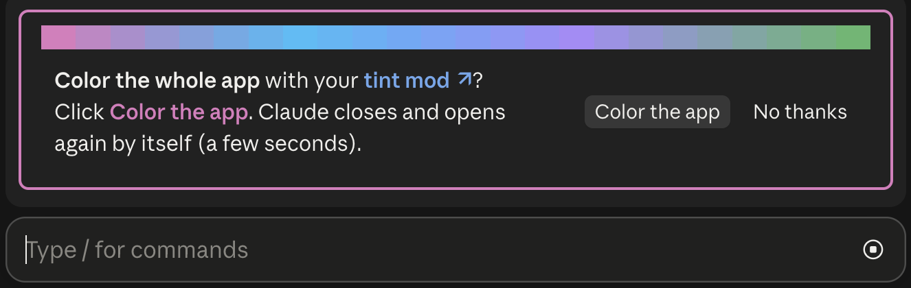
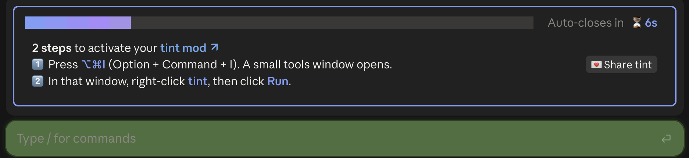

<p align="center">
  
</p>

<p align="center">
  <a href="CHANGELOG.md"></a>
  <a href="LICENSE"></a>
  <a href="https://code.claude.com/docs/en/plugins/mods/overview"></a>
</p>

# tint for Claude Code

**Never type into the wrong Claude Code window again.** tint gives every repository its own emoji and color, and every window a number, so two or three windows side by side are easy to tell apart.

| Where | What you get |
|---|---|
| 🪟 **Window titles** | `🧪1️⃣ Fix login bug`: the repo's emoji, the window's number, the main topic |
| 💻 **Terminal** | a strip in the repo's color above the prompt |
| 🖥️ **Desktop app** | the whole app in color: a ring around the window you're in, a soft tint, colored repo names in the sidebar |

---

## 🚀 Get started

### Step 1. Install tint

Pick where you use Claude Code. Install once: it works in both the desktop app and the Terminal.

<details open>
<summary><b>🖥️ In the Claude desktop app</b></summary>

1. In the message box, type `/plugin` and press **Enter**. **Settings → Plugins** opens.
2. Click **+ Add** (top right), then **Add marketplace**.
3. In **URL**, paste this, then click **Sync**:
   ```
   JimmySadek/claude-code-tint-mod
   ```
4. **Tint** now shows in **Discover**. Click **Add**.
5. Start a new session.

Updates: the desktop app has no auto-update switch. When a new version is out, tint's band says so, with an **Update now** button.

> [!IMPORTANT]
> In the desktop app, typing `/plugin marketplace add …` only opens **Settings → Plugins**. Use the clicks above.
</details>

<details>
<summary><b>💻 In Claude Code in the Terminal</b></summary>

Type these 3 commands in Claude Code, **one at a time**, pressing **Enter** after each:

1. Add tint's marketplace:
   ```
   /plugin marketplace add JimmySadek/claude-code-tint-mod
   ```
2. Install tint:
   ```
   /plugin install tint@claude-code-tint-mod
   ```
3. Load it:
   ```
   /reload-plugins
   ```

Then turn on auto-update, so you get new versions and fixes by themselves: type `/plugin` → **Marketplaces** → **claude-code-tint-mod** → **Enable auto-update**.
</details>

✅ **Installed.** From your first prompt, each repository gets its emoji and color: in the window title, and as a strip in the Terminal.

### Step 2. Color the whole desktop app

**Click once.** A band above the message box asks **"Color the whole app with your tint mod?"** Click **Color the app**. Claude closes and opens again by itself, which takes a few seconds.

<p align="center">
  
</p>

### Step 3. Turn the colors on

**2 steps**, and the band shows you how:

<p align="center">
  
</p>

> [!NOTE]
> **What to expect.** The desktop app forgets the colors every time it restarts. So **after each app start**, this band comes back with the same 2 steps: press **⌥⌘I**, then right-click **tint** → **Run**. It takes about 5 seconds. The band closes by itself after 60 seconds. The terminal needs none of this.


---

## 🔄 Stay up to date

When a new version is out, tint tells you: the band's last line says **✨ New version**, with an **Update now** button.

| Where | Update | Auto-update |
|---|---|---|
| 🖥️ **Desktop app** | Click **Update now**. Or type `/plugin`, choose **Tint**, then click **Update**. | The app has no switch for it, so tint tells you instead. |
| 💻 **Terminal** | Click **Update now**, or type `/mod_tint update`. Then type `/reload-plugins`. | Once: type `/plugin` → **Marketplaces** → **claude-code-tint-mod** → **Enable auto-update**. |

> [!TIP]
> **Why isn't auto-update on by default?** Claude Code turns it on by itself only for Anthropic's own marketplaces. For any other marketplace, only you can, and tint never changes your settings.

---

## ⌨️ Commands

**You don't need to remember any of this.** Type `/mod_tint` alone, or say what you want in your own words: `/mod_tint new emoji`, `/mod_tint 🧪`, `/mod_tint go back`, `/mod_tint make it green`. Claude works out what you mean and asks you with a few choices to click. `/mod_tint help` shows this list.

| Command | What it does |
|---|---|
| `/mod_tint name Backend` | Name this window. `/mod_tint name` alone clears it. |
| `/mod_tint icon 🧪` | Choose the repo's emoji. The color follows it. |
| `/mod_tint color #7C3AED` | Choose the repo's color: a `#hex` or a name (red, orange, yellow, lime, green, teal, cyan, blue, indigo, purple, pink, brown). |
| `/mod_tint repick` | Claude looks at what the repo is for and offers 3 new emoji to choose from. |
| `/mod_tint undo` | Back to the emoji and color before the last change. |
| `/mod_tint pattern waves` | Terminal strip pattern: triangles, circles, stripes, diamonds, waves, hexes, blocks, chevrons. |
| `/mod_tint frame on` · `off` | A colored border around your own messages (off at first). |
| `/mod_tint titles off` · `on` | Stop or restart Claude keeping the window title on the main topic. |
| `/mod_tint off` · `on` | Hide or show the tint in this window. |
| `/mod_tint reset` | Forget this repo's choices; Claude picks again. |
| `/mod_tint desktop` | The whole-app colors: how to turn them on, or install or update them. |
| `/mod_tint update` | Get the newest tint, then type `/reload-plugins`. |

Choices are shared by every window of a repo, in `~/.claude/window-tint/repos.json`.

---

## 🖥️ How the desktop colors work

A mod can draw inside the conversation, but not the app around it. So tint saves a small script in the desktop app's **DevTools** (its built-in developer tools) as a snippet named `tint`, and you run it after each app start.

**The install** (the **Color the app** button, or `/mod_tint desktop go`) opens **Terminal**, which:

1. quits Claude,
2. backs up the app's settings to `~/.claude/window-tint/Preferences.backup`,
3. saves the snippet `tint` and sets DevTools to open on it,
4. turns on **Developer Mode** if it is off (the app's switch for DevTools),
5. opens Claude again.

**What you see:** the window you type in gets a ring and a soft tint; other open windows a lighter tint; the sidebar stays calm, with repo names in their color; the loading dots and Claude's ✳ take each window's color. Light and dark mode both work. New repositories are picked up by themselves.

**What it touches:** the script only changes how the open page looks. It sends nothing, stores nothing and changes no file. To turn it off, reload the app.

<details>
<summary>❓ Why not fully automatic?</summary>

The desktop app doesn't load outside scripts. It refuses to start with debugging switches and its code is sealed, which protects your signed-in account. A saved DevTools snippet is the safe way in. The app also rewrites its settings while it runs, which is why the install quits it first.
</details>

<details>
<summary>🔧 Install by hand instead</summary>

**Run the Terminal line yourself:** `/mod_tint desktop line` copies it. Paste it in Terminal and press Enter.

**Or without Terminal:** turn on Developer Mode (**Help → Troubleshooting → Enable Developer Mode…**), then:

1. Type `/mod_tint css`. The script is now on your clipboard.
2. In the desktop app: **⌥⌘I** → **Sources** → **Snippets** (behind **»** if hidden) → **+ New snippet**, name it `tint`, paste with **⌘V**, save with **⌘S**.
3. Right-click `tint` → **Run**.
</details>

<details>
<summary>🔌 Turn Developer Mode off again</summary>

The app has no menu item for it. Quit Claude, then run this in Terminal:

```bash
printf '{"allowDevTools": false}\n' > ~/Library/Application\ Support/Claude/developer_settings.json
```
</details>

---

## 🩺 Troubleshooting

| You see | Do this |
|---|---|
| `/mod_tint` does nothing | Start a **new** session. Still nothing? Run `claude plugin list` in Terminal and check that `tint@claude-code-tint-mod` says **enabled**. |
| ⌥⌘I does nothing | Developer Mode is off: **Help → Troubleshooting → Enable Developer Mode…** |
| Terminal says the app did not quit | Claude may be asking you to confirm. Quit it yourself (**⌘Q**), then run `/mod_tint desktop go` again. |
| No Terminal window opened | Type `/mod_tint desktop line`, then paste the copied line in Terminal and press Enter. |
| The app looks wrong after the install | Quit Claude and copy `~/.claude/window-tint/Preferences.backup` back over `~/Library/Application Support/Claude/Preferences`. |
| `ReferenceError: tint is not defined` | You typed the name in the Console. Run it from **Sources → Snippets**: right-click `tint` → **Run**. |
| A repo's name stays grey | Its threads have no emoji yet. Send a second message in one of its windows, or set a color with `/mod_tint color`. |
| The tint looks doubled or stuck | Reload the app, then run the snippet once. |
| The tint stopped working after an app update | Type `/mod_tint css scan`, run it the same way, and [open an issue](../../issues/new/choose) with the report. The scan only reads. |

---

## 🔒 What it uses

- **One small AI call per repository, once:** the first window of a new repo asks Claude Haiku for an emoji that fits it (from its name and README). The answer is saved and reused. Scripted runs (`claude -p`) never ask.
- **No AI for colors:** the color is measured from the emoji on your Mac by a small Swift program.
- **Window titles:** on your 2nd prompt and then every 5th, a short hidden note asks Claude to rename the window if its main topic changed. Off with `/mod_tint titles off`.
- **One small web request a day:** tint asks GitHub for its newest version number (`api.github.com`). Nothing about you is sent. It never changes your settings.
- **Files:** only `~/.claude/window-tint/`.

## 🗑️ Uninstall

```bash
claude plugin uninstall tint@claude-code-tint-mod
```

Your choices stay in `~/.claude/window-tint/`. Delete that folder too if you want nothing left.

## 📋 Requirements

- Claude Code **2.1.287** or later.
- macOS for the emoji color measuring and the desktop colors. Elsewhere, Claude's own color choice is used.
- The desktop script was built against Claude desktop **2.26454** (October 2026).

## 🛠️ For contributors

```bash
claude plugin validate .
```

```bash
claude plugin test .
```

How it works inside: [docs/how-it-works.md](docs/how-it-works.md). How releases work: [docs/releasing.md](docs/releasing.md).

## License

MIT. See [LICENSE](LICENSE).
